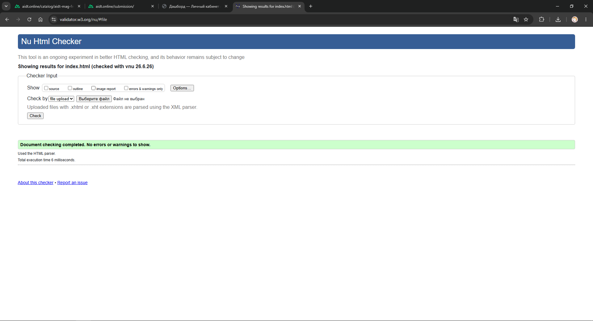

# Лабораторная 01. Семантическая разметка дашборда «Личный кабинет магистранта»

**Студент:** Карунин Илья Игоревич, группа мРИС-251

## Цель работы

Собрать семантичный HTML-каркас главной страницы дашборда референсного проекта «Личный кабинет магистранта» по Figma-макету и освоить базовый инструментарий фронтенд-разработчика: Emmet в редакторе, DevTools в браузере и валидатор разметки Nu Html Checker. CSS и JavaScript на этом этапе не подключаются — оценивается только структура документа.

## Задание

По Figma-макету (`aidt-mag-frontend-sample`, фрейм `dashboard-student-light`) и брифу `pz-env/brief.md` разметить главную страницу дашборда семантическими тегами HTML5 без CSS и JavaScript: заполнить `<head>` (`charset`, `viewport`, `title`, `description`); разметить шапку приложения, навигацию-сайдбар, основной контент с секциями KPI, расписания, прогресса, дедлайнов и уведомлений. Соблюсти иерархию заголовков без «перескоков», использовать списки, `<time datetime>` для всех дат, `<meter>` для прогресса, `<a href>` для ссылок и `<button type="button">` для действий. Провести аудит разметки в DevTools и пройти Nu Html Checker без ошибок.

## Ход выполнения

### Часть 1. Каркас документа и метаинформация

Создан файл `lab-01/index.html`. Базовый каркас развёрнут Emmet-аббревиатурой `!` + `Tab` и доведён до требований проекта: атрибут `lang="ru"` на `<html>`; `<meta charset="utf-8">` и `<meta name="viewport" content="width=device-width, initial-scale=1">`; `<title>Дашборд — Личный кабинет магистранта ВГТУ</title>`; добавлен `<meta name="description">` с кратким описанием назначения страницы. CSS и JavaScript не подключались. Страница открывается в браузере без ошибок в консоли, структура `<head>` в *Elements* читается сверху вниз.

### Часть 2. Структура дашборда по макету

Тело документа размечено семантическими тегами в соответствии с именами слоёв макета и брифом:

- Шапка — `<header class="app-header">`: логотип кафедры в ссылке `<a href="/">`; поле поиска `<input type="search">` внутри `<form role="search">`, подсказка `Ctrl+K` / `Cmd+K` в `<kbd>`; действия справа (`<div class="header-actions">`) — переключатель темы, уведомления с числовым бейджем и меню профиля, все как `<button type="button">`.
- Сайдбар — `<aside class="sidebar">` с `<nav>` и списком `<ul>`/`<li>` из семи иконочных пунктов (`nav-home` … `nav-reference`); текущий пункт `nav-home` помечен `aria-current="page"`.
- Основной контент — `<main class="main-content">`: хлебные крошки `<nav aria-label="Хлебные крошки">` со списком `<ol>`; единственный `<h1>`; подзаголовок с датой в `<time datetime="2026-04-24">` и семестром в `<small>`; секция KPI (`<section>` с визуально скрытым заголовком `<h2 class="visually-hidden">` и четырьмя `<article>` с `<h3>`); секции «Расписание», «Прогресс», «Дедлайны», «Уведомления» — каждая `<section>` с `<h2>` и списком, `<time>` для дат, `<meter min="0" max="100">` для прогресса, `<span class="tag">` для типа занятия.
- Футер, модальные окна и горизонтальное меню не добавлены — в макете их нет.

Иерархия заголовков выдержана: один `<h1>`, секции — `<h2>`, карточки — `<h3>`.

Самый длинный фрагмент собран Emmet-аббревиатурой:

```
section.card-schedule>h2+ol>li*4>time+span.lesson-title+small.lesson-place+span.tag
```

### Часть 3. Отладка через DevTools и валидация

Ответы на контрольные пункты части 3:

1. **Что нашли в *Elements*, чего нет в исходнике.** Разметка валидна, поэтому DOM в *Elements* практически повторяет исходный текст. Браузер гарантированно материализует `<html>`/`<head>`/`<body>` (в файле они и так есть) и разрешает относительные URL ссылок (`/profile` и т. п.) в абсолютные относительно базового адреса документа — это видно при наведении на ссылку. Автовставки `<tbody>` не произошло: таблиц `<table>` в макете нет, а пробелы между тегами *Elements* показывает как отдельные текстовые узлы.
2. **Какие user-agent styles сильнее всего влияют.** (1) `body { margin: 8px }` — отступ от краёв окна; (2) `ul`/`ol { padding-inline-start ≈ 40px }` и маркеры/нумерация через `list-style`; (3) заголовки `h1–h3 { увеличенный font-size, font-weight: bold, вертикальные margin }`. Дополнительно ссылки получают синий цвет и подчёркивание — поэтому страница без CSS всё равно «как-то выглядит».
3. **Расхождения между *Sources → Page* и *Elements*.** JavaScript не подключён и разметка валидна, поэтому содержимое почти совпадает. Разница в природе панелей: *Sources* показывает исходный текст файла «как написан», а *Elements* — дерево DOM после парсинга; ощутимые расхождения проявились бы при наличии JS или невалидной вложенности.
4. **Какие предупреждения валидатора приняли осознанно.** При первом прогоне Nu Html Checker сообщил об одной *ошибке*: заголовок `<h3>` карточки KPI следовал за `<h1>`, пропуская уровень `<h2>` (skipping a heading level). Ошибка исправлена добавлением заголовка секции KPI — `<h2 class="visually-hidden">Ключевые показатели</h2>` (визуально он будет скрыт стилями на ПЗ-2, по макету видимого заголовка у секции нет). После исправления цепочка заголовков стала `h1 → h2 → h3` без перескоков, повторная проверка даёт 0 errors и 0 warnings — осознанно принимать нечего.

Клавиатурная навигация проверена: `Tab` последовательно проходит по ссылке-логотипу, полю поиска, кнопкам шапки, пунктам сайдбара и ссылкам контента — порядок близок к визуальному.

Результат проверки в Nu Html Checker (0 errors):



## Результаты

Получен файл `lab-01/index.html` — валидный семантический каркас дашборда без CSS и JavaScript; Nu Html Checker проходит с результатом 0 errors. Использованы секционирующие элементы (`header`, `aside`, `nav`, `main`, `section`, `article`), списки для всех перечислений, `<time>` с машиночитаемым `datetime`, `<meter>` для прогресса и ARIA-атрибуты (`aria-label`, `aria-current`). Работа зафиксирована коммитами в ветке `lab-01/v1` и оформлена как Merge Request в `main`.

## Ответы на контрольные вопросы

1. Аббревиатура `!` + `Tab` разворачивает: `<!DOCTYPE html>`, `<html lang>`, `<head>` с `<meta charset>` и `<meta viewport>`, `<title>` и пустой `<body>`. На продакшн-странице нельзя опустить: `<!DOCTYPE html>` (без него браузер уходит в quirks mode и иначе считает блочную модель), `<meta charset="utf-8">` (без явной кодировки — «кракозябры» и риск XSS через подмену кодировки), `<title>` (обязателен по спецификации, отображается во вкладке и в поиске) и `<html lang>` (нужен скринридерам, переводчикам и SEO). `<meta viewport>` нужен для корректного отображения на мобильных.
2. *Sources → Page* показывает исходный HTML-текст до парсинга, а *Elements* — живое дерево DOM после парсинга и работы JavaScript. Различаются, когда скрипт меняет DOM или браузер чинит невалидную разметку. Пример: исходник содержит `<table><tr><td>…`, а в *Elements* внутри таблицы появляется `<tbody>`, которого в *Sources* нет.
3. User-agent stylesheet — встроенная таблица стилей браузера, применяемая по умолчанию до авторского CSS. Примеры: `body { margin: 8px }`, `ul/ol { padding-inline-start ≈ 40px; list-style }`, `h1 { font-size: 2em; font-weight: bold }`. Видно в DevTools на вкладке *Elements* в панели *Styles*, блок «user agent stylesheet».
4. `<article>` — самодостаточный, независимо распространяемый фрагмент, осмысленный сам по себе; `<section>` — тематическая группировка контента внутри документа, часть большего целого. На дашборде карточка KPI «Средний балл» — `<article>` (законченная переиспользуемая единица), а «Расписание на сегодня» — `<section>` (тематический раздел страницы).
5. Несколько `<nav>` уместны при навигационных блоках разного назначения: основная навигация, хлебные крошки, пагинация, оглавление. В дашборде их два — сайдбар и хлебные крошки. Различают по доступному имени через `aria-label` (`"Основная навигация"` и `"Хлебные крошки"`); в дереве доступности и у скринридера это отдельные ландмарки, что позволяет быстро перейти к нужной навигации.
6. `<meter>` — измеренное скалярное значение в известном диапазоне `min…max` (заполненность, оценка); `<progress>` — индикатор выполнения задачи, движущейся к завершению. «Прогресс по дисциплине» — измеренный уровень усвоения по шкале 0–100, статичная величина-датчик, поэтому `<meter>`. «Загрузка файла» — задача к завершению, поэтому `<progress>`.
7. Без `<meta name="viewport">` мобильный браузер использует виртуальный viewport ≈ 980 px и рисует «десктопную» страницу, уменьшая её под экран — текст мелкий, нужен зум. Тег задаёт `width=device-width` и `initial-scale=1`, то есть верстать под реальную ширину устройства. Это слой отрисовки, а не оформления, поэтому нужен уже сейчас.
8. Атрибут `datetime` даёт машиночитаемое значение даты/времени в ISO, тогда как текст внутри `<time>` — для человека («через 3 дня»). `datetime` нужен программам: поисковикам, календарям, скринридерам, скриптам (сортировка, вычисления). Человек видит удобный текст, машина — однозначный атрибут.
9. `aria-label` задаёт доступное имя элементу без видимого текстового заголовка — пример: `<nav aria-label="Хлебные крошки">` (отличает хлебные крошки от основной навигации). `aria-current="page"` помечает текущую страницу/пункт — пример: `<a class="nav-home" aria-current="page">` в сайдбаре и `<li aria-current="page">Дашборд</li>` в хлебных крошках. (В секции KPI заголовок задан через `<h2>` и связан с секцией атрибутом `aria-labelledby` — это и убирает перескок уровней, и даёт секции доступное имя.)
10. Самый длинный фрагмент — секция расписания: `section.card-schedule>h2+ol>li*4>time+span.lesson-title+small.lesson-place+span.tag`. Расшифровка: секция с классом `card-schedule`, внутри `<h2>` и `<ol>` с четырьмя `<li>`; в каждом `<li>` — `<time>`, `<span class="lesson-title">`, `<small class="lesson-place">` и `<span class="tag">`.

## Выводы

Освоены семантические секционирующие и текстовые элементы HTML5 и обоснование выбора тегов, инструмент Emmet для быстрого разворачивания разметки, аудит DOM и user-agent-стилей в DevTools и валидация через Nu Html Checker. Полученный каркас служит основой для следующих занятий, где на него ляжет CSS, а затем поведенческий слой.

## Источники

- MDN Web Docs. HTML — https://developer.mozilla.org/ru/docs/Web/HTML
- HTML Living Standard (WHATWG) — https://html.spec.whatwg.org/multipage/
- Emmet Cheat Sheet — https://docs.emmet.io/cheat-sheet/
- Nu Html Checker (W3C) — https://validator.w3.org/nu/
- Chrome DevTools — https://developer.chrome.com/docs/devtools
- Учебное пособие курса, тема 1 «Введение в веб-стек, HTML, семантика».
